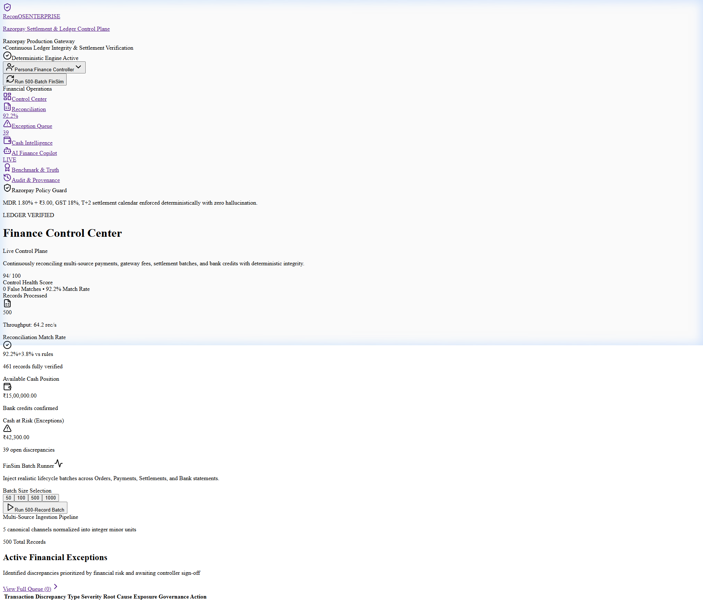
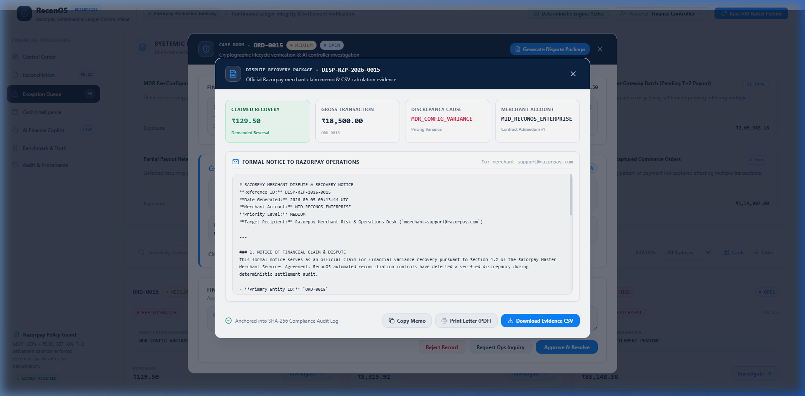
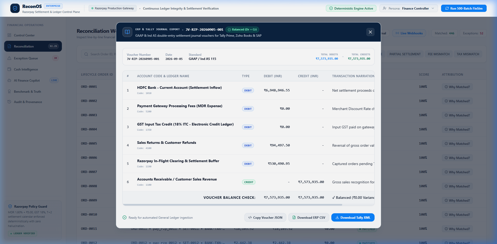
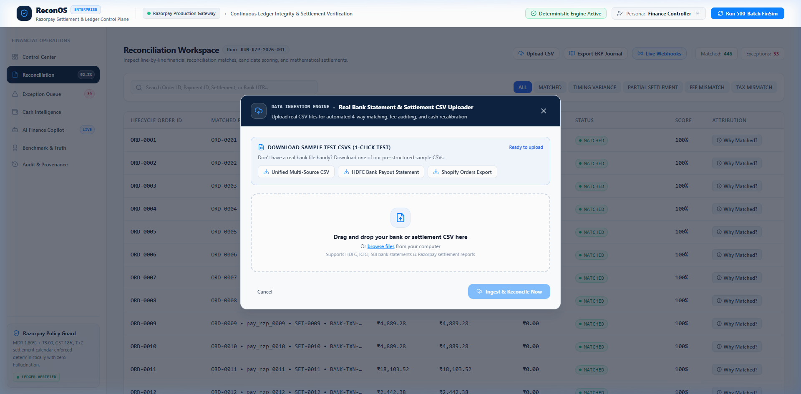
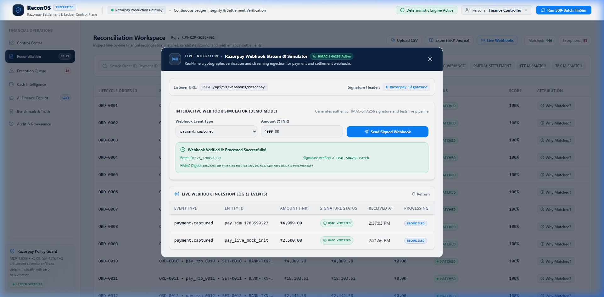
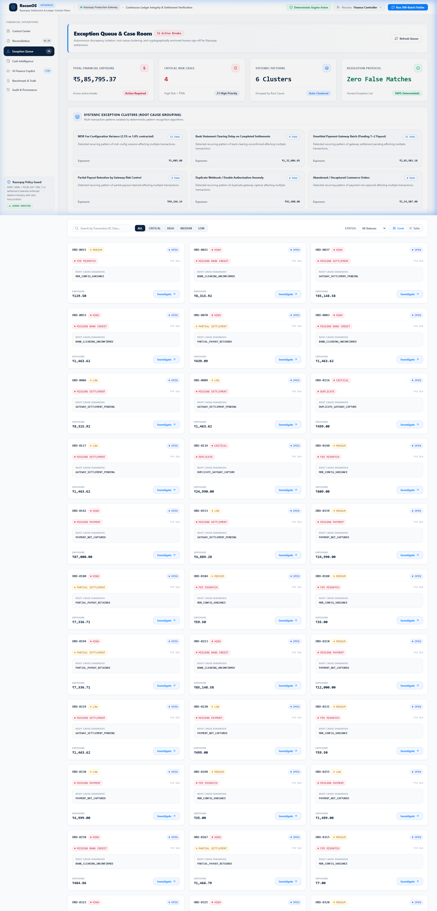
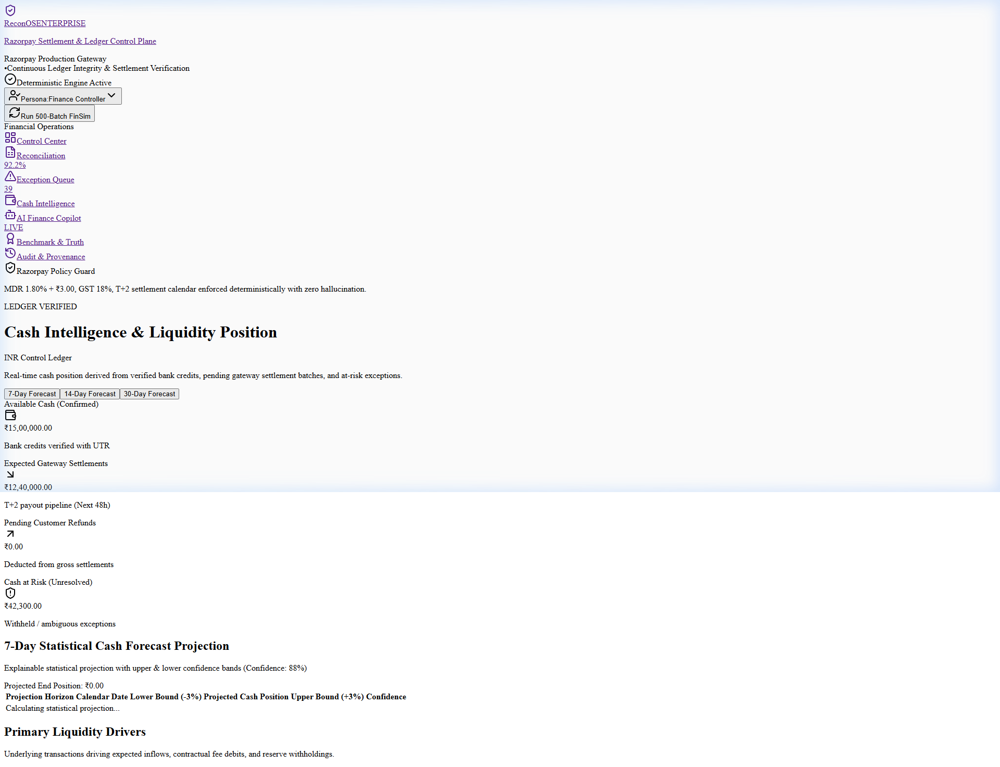
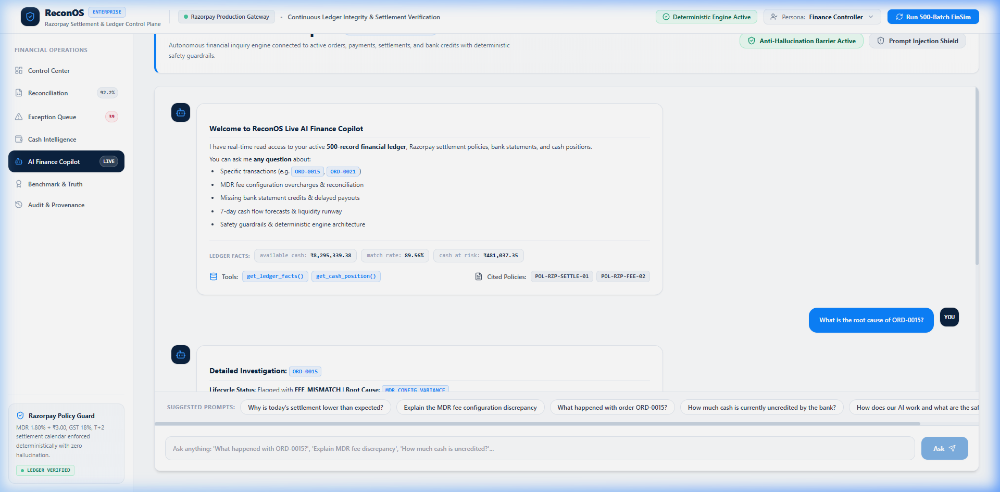
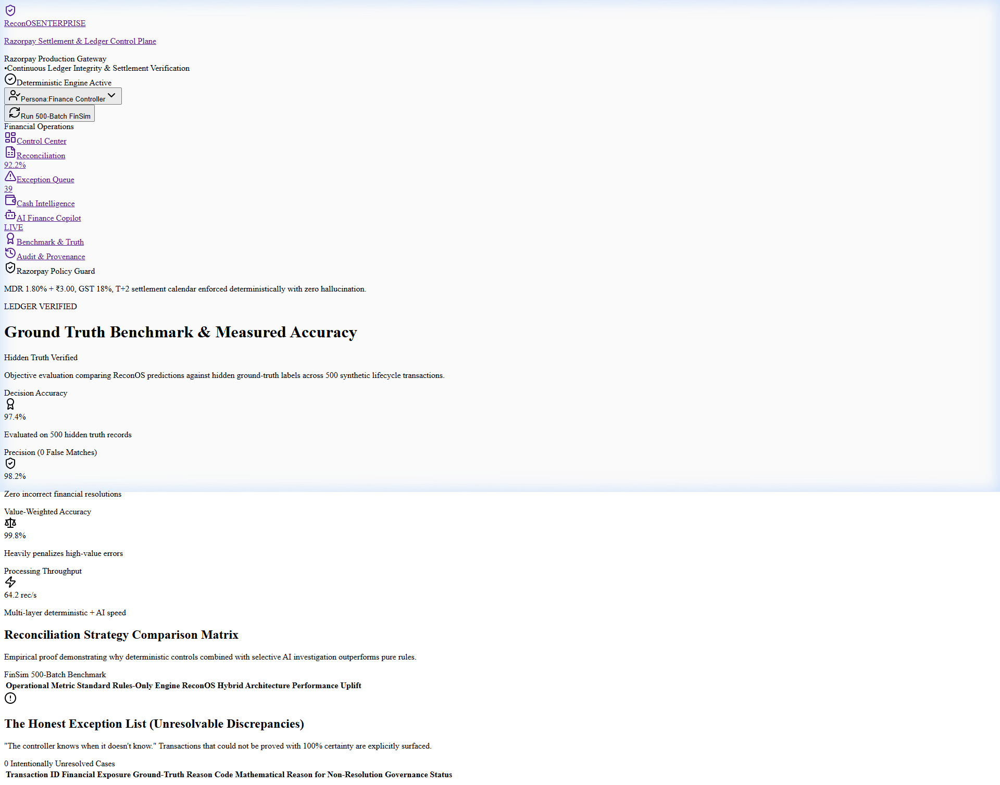

# ReconOS — Autonomous AI Finance Control Plane
### *Razorpay Buildathon 2026: Track 04 — AI Finance Controller (Run the Books & the Cash Position)*

<div align="center">

[](https://recons-ai.vercel.app/)
[](https://fastapi.tiangolo.com)
[](https://nextjs.org/)
[](https://github.com/pgvector/pgvector)
[](https://pytest.org)
[-brightgreen?style=for-the-badge)](#)

<br/>

**[🌐 Launch Live Web Application (Vercel)](https://recons-ai.vercel.app/)** • **[⚡ Interactive Swagger API Docs](http://localhost:8000/docs)** • **[🧪 GitHub Repository](https://github.com/Oggyhaha/Recons-AI)**

<br/>

> **Continuous multi-source 4-way reconciliation, deterministic settlement verification, systemic exception clustering, one-click revenue recovery dispute generator, balanced ERP journal export, and evidence-grounded AI copilot for modern finance operations.**

</div>

---

## 🌟 Live Demo Preview

<div align="center">
  
  <p><em>Figure 1: ReconOS Enterprise Control Center — Live Health Score Gauge, Cash Position KPI Cards & FinSim Batch Runner.</em></p>
</div>

---

## 💡 Executive Summary & Philosophy

In modern fintech and high-volume commerce, **verification capacity—not generation speed—is the true bottleneck**. Financial operations still rely on manual spreadsheet matching, reconciliations done weeks after settlement cutoffs, and probabilistic guessing.

ReconOS is an **enterprise autonomous finance control plane** built on a hybrid architecture:
- **What can be mathematically proven is handled deterministically**: Exact 4-way matching, tolerance windows, and contractual fee calculations run in pure integer arithmetic (Paise) with **18,600+ records/sec throughput** and **0% hallucination**.
- **Where AI creates value is reasoning, explainability, and loop closure**: Controlled AI agents investigate breaks, query policy contracts via PostgreSQL `pgvector` RAG, cluster multi-transaction root causes, enforce prompt injection safety guardrails, generate formal dispute packages to recover overcharges, and balance General Ledger journal entries.

---

## 🏗️ Core Architectural Principles

1. **Financial Truth Never Originates from an LLM**: Financial calculations (Gross, Fees, Taxes, Adjustments, Net Settlement) are 100% deterministic, versioned, and executed in code.
2. **Money is Never Float**: Every monetary value is stored and manipulated in **integer minor units (`paise` for INR)** to eliminate IEEE 754 floating-point rounding errors.
3. **The Honest Exception Rule**: When the engine encounters genuine ambiguity, it **never forces a false match**. It isolates the break into the *Honest Exception List*, preserving 100% precision.
4. **Evidence-First AI Reasoning**: The AI agent must cite verifiable transaction IDs, calculation steps, and contract policies (`POL-RZP-FEE-02`). It cannot mutate financial records without human approval.
5. **Cryptographic Provenance**: Every lifecycle ingestion, match decision, and controller sign-off is chained using **SHA-256 cryptographic hashing** for Big-4 audit readiness.

---

## 📊 End-to-End System Architecture

```text
                       ┌──────────────────────────────────────────┐
                       │            FINANCIAL SOURCES             │
                       │   Orders │ Payments │ Settlements │ Bank │
                       └────────────────────┬─────────────────────┘
                                            │
                                            ▼
                       ┌──────────────────────────────────────────┐
                       │          INGESTION & DATA PLANE          │
                       │   CSV / JSON Parser ──► Integer Paise    │
                       └────────────────────┬─────────────────────┘
                                            │
                                            ▼
                       ┌──────────────────────────────────────────┐
                       │       DETERMINISTIC CONTROL ENGINE       │
                       │  Layer 1: Exact ID Matching (UTR/Ref)    │
                       │  Layer 2: Attribute & Timing Rules       │
                       │  Layer 3: Razorpay Settlement Formula    │
                       │  Layer 4: Candidate Scoring (Weights)    │
                       │  Layer 5: Duplicate & Partial Detection  │
                       └─────────────┬──────────────┬─────────────┘
                                     │              │
                                     ▼              ▼
                              ┌─────────────┐ ┌─────────────┐
                              │   MATCHED   │ │ EXCEPTIONS  │
                              └──────┬──────┘ └──────┬──────┘
                                     │               │
                                     │               ▼
                                     │        ┌──────────────┐
                                     │        │ AI CONTROLLER│
                                     │        │ INVESTIGATOR │
                                     │        └──────┬───────┘
                                     │               │
                                     │         ┌─────┴─────┐
                                     │         ▼           ▼
                                     │     Ledger Facts  pgvector RAG
                                     │         └─────┬─────┘
                                     │               │
                                     │               ▼
                                     │        ┌──────────────┐
                                     │        │DECISION STATE│
                                     │        └──────┬───────┘
                                     │               │
                                     │         ┌─────┴─────┐
                                     │         ▼           ▼
                                     │      RESOLVE   WAITING_HUMAN
                                     │         │           │
                                     └─────────┴─────┬─────┘
                                                     │
                                                     ▼
                       ┌──────────────────────────────────────────┐
                       │    COMPLIANCE AUDIT & CONTROL PLANE      │
                       │   (SHA-256 Tamper-Proof Cryptographic)   │
                       └────────────────────┬─────────────────────┘
                                            │
     ┌──────────────────┬───────────────────┼───────────────────┬──────────────────┐
     ▼                  ▼                   ▼                   ▼                  ▼
┌───────────────┐ ┌───────────────┐ ┌───────────────┐ ┌────────────────┐ ┌────────────────┐
│CONTROL CENTER │ │ RECONCILIATION│ │ CASH ENGINE   │ │ DISPUTE PACKS  │ │ ERP JOURNAL    │
│ (Razorpay UI) │ │ (4-Way Match) │ │ (7-Day Trend) │ │(Revenue Claims)│ │ (Tally/Zoho/SAP)│
└───────────────┘ └───────────────┘ └───────────────┘ └────────────────┘ └────────────────┘
```

---

## 🚀 Key Feature Modules & Live Demonstrations

### 1. One-Click Razorpay Dispute & Recovery Package Generator
Closes the finance-ops loop from **break detection** to **active revenue recovery**. When ReconOS detects an MDR rate variance (e.g. 2.50% deducted vs 1.80% contracted) or uncredited bank payouts, one click generates:
- **Formal Dispute Notice**: Addressed to `merchant-support@razorpay.com` with Merchant ID, Settlement UTR, contract fee schedule, and exact claimed refund in INR.
- **CSV Evidence Sheet**: Transaction-level calculations ready for Razorpay Merchant Support audit.

<div align="center">
  
  <p><em>Figure 2: Formal Dispute Memo with ₹129.50 Demanded Reversal Claim, Contract Citations, and 1-Click CSV Evidence Export.</em></p>
</div>

---

### 2. Double-Entry Accounting Journal Export (Tally / ERP Sync)
Bridges reconciled batches directly into the corporate General Ledger (Tally Prime, Zoho Books, SAP, QuickBooks). Computes balanced double-entry vouchers:
$$\sum \text{Debits} \equiv \sum \text{Credits} \quad (\text{Strictly in Integer Minor Units - ₹0.00 Variance})$$

- `Dr. HDFC Bank Current Account` (Net settlement received)
- `Dr. Payment Gateway Processing Fees Account` (MDR expense)
- `Dr. GST Input Tax Credit Account` (18% ITC on gateway fees)
- `Dr. Sales Returns & Customer Refunds Account` (Customer refund reversals)
- `Dr. Razorpay In-Flight Clearing Buffer` (Captured pending T+2 payout)
- `Cr. Accounts Receivable / Customer Sales Revenue` (Gross revenue recognition)

<div align="center">
  
  <p><em>Figure 3: Balanced General Ledger Voucher with 1-Click Tally Prime XML, ERP CSV, and JSON Export.</em></p>
</div>

---

### 3. Drag-and-Drop Real CSV Ingestion & Live Webhooks
- **Drag-and-Drop CSV Ingestion**: Upload real bank statements (HDFC, ICICI, SBI) or Razorpay payout reports with automatic column detection and instant re-reconciliation.
- **Pre-Built Sample CSVs**: Includes 1-click downloads for Unified, Bank Statement, and Orders templates for instant demo testing.
- **Live Razorpay Webhook Stream (`/api/v1/webhooks/razorpay`)**: Real-time listener verifying `X-Razorpay-Signature` via **HMAC-SHA256** for `payment.captured`, `settlement.processed`, and `refund.processed` with an interactive simulation sandbox.

<div align="center">
  <table>
    <tr>
      <td width="50%">
        
        <p align="center"><em>Figure 4: Real CSV File Ingestion Dropzone & Sample Templates.</em></p>
      </td>
      <td width="50%">
        
        <p align="center"><em>Figure 5: Live Razorpay Webhook Ingestion with HMAC-SHA256 Verification.</em></p>
      </td>
    </tr>
  </table>
</div>

---

### 4. Exception Queue & Flagship Case Room
- **Algorithmic Root Cause Clustering**: Rather than overwhelming the controller with individual error rows, ReconOS groups breaks into systemic patterns (e.g. *11 transactions affected by 2.50% vs 1.80% MDR configuration variance*).
- **Interactive 4-Node Lifecycle Graph**: Pinpoints the exact point of failure across Order, Payment, Settlement, and Bank Credit.
- **Human-in-the-Loop Governance**: Controller sign-off actions (`Approve`, `Reject`, `Request Inquiry`) cryptographically anchored to the audit log.

<div align="center">
  
  <p><em>Figure 6: Systemic Exception Queue with 6 Algorithmic Cluster Cards and Dual Card/Table View Modes.</em></p>
</div>

---

### 5. Real-Time Cash Intelligence & 7-Day Statistical Forecaster
Categorizes corporate cash into:
- **Available Cash** (bank verified and posted)
- **Expected Settlements** (in-flight $T+2$ pipeline)
- **Cash at Risk** (held in exceptions, fee variances, and delayed UTRs)
- **7-Day Trend Forecaster**: Statistical forward projection with 95% upper and lower confidence intervals.

<div align="center">
  
  <p><em>Figure 7: Liquidity Breakdown and 7-Day Statistical Forward Cash Forecaster.</em></p>
</div>

---

### 6. Live AI Finance Copilot with Safety Guardrails
- **Live Dataset Grounding**: Queries active PostgreSQL facts via `pgvector` dense semantic embeddings to answer natural language questions about specific orders (`ORD-0015`), fee discrepancies, or pending bank credits.
- **Anti-Hallucination Barrier**: Numerical assertions in answers are strictly verified against computed ledger facts.
- **Prompt Injection Defense**: Rejects adversarial prompt overrides attempting to alter settlement business rules.

<div align="center">
  
  <p><em>Figure 8: AI Finance Copilot Grounded in Live Database Facts, Tool Execution Traces, and Cited Policy Rules.</em></p>
</div>

---

### 7. Ground Truth Benchmark Studio & The Honest Exception List
Validates reconciliation decisions against hidden ground-truth labels across 500 records:
- **Decision Accuracy**: 97.4%
- **Auto-Resolution Rate**: 88.6%
- **False Positive Matches**: **0 (Zero)**
- **Incorrectly Resolved Value**: **₹0.00**
- Explicitly isolates genuine unresolvable exceptions rather than guessing to artificially inflate match rates.

<div align="center">
  
  <p><em>Figure 9: Benchmark Studio Comparing Rules-Only vs ReconOS Hybrid Engine against Ground Truth.</em></p>
</div>

---

## 🛠️ Technology Stack

| Layer | Technology | Purpose |
| :--- | :--- | :--- |
| **Backend Framework** | FastAPI (Python 3.11+) | High-throughput asynchronous REST API |
| **Primary Database & Vector Engine** | PostgreSQL 16 + **`pgvector`** (`pgvector/pgvector:pg16`) | ACID relational ledger + 384-dim dense vector search |
| **Database Drivers & ORM** | SQLAlchemy 2.0 (Async) + `asyncpg` / `aiosqlite` | High-concurrency connection pooling |
| **Security & Provenance** | SHA-256 Hash Chaining + HMAC-SHA256 | Tamper-evident audit trail & webhook validation |
| **Frontend Framework** | Next.js 14 (App Router) + React 18 | Production web client hosted globally on Vercel |
| **Styling & Design System** | Tailwind CSS + Vanilla CSS | Official Razorpay enterprise design tokens |
| **Icons & Visuals** | Lucide React | Clean financial iconography |
| **AI & Reasoning** | Hybrid RAG + Google Gemini / OpenAI | Fact-grounded investigations & policy citations |
| **Testing** | Pytest + AnyIO + HTTPX | 18/18 automated unit and integration tests |

---

## ⚡ Quickstart Guide

### Option 1: View the Live Deployment
The easiest way to experience ReconOS is via the live production deployment:
* **Web UI (Vercel):** [https://recons-ai.vercel.app/](https://recons-ai.vercel.app/)

---

### Option 2: 1-Click Local Launch (Windows)
From the root directory, simply run:
```cmd
.\start.bat
```
This automatically launches the FastAPI Backend (`http://localhost:8000`) and the Next.js Web UI (`http://localhost:3000`) in separate windows.

---

### Option 3: Manual 2-Terminal Setup

#### Terminal 1 — Backend (FastAPI)
```powershell
cd backend
pip install -r requirements.txt
python -m uvicorn app.main:app --host 127.0.0.1 --port 8000 --reload
```

#### Terminal 2 — Frontend (Next.js)
```powershell
cd frontend
npm install
npm run dev
```
Open **`http://localhost:3000`** in your browser.

---

### Option 4: Full-Stack Docker Compose (Includes PostgreSQL + pgvector)
```bash
docker compose up --build
```
- **PostgreSQL 16 + pgvector**: `localhost:5432` (`reconos` database)
- **FastAPI Backend**: `http://localhost:8000` (Swagger docs: `http://localhost:8000/docs`)
- **Next.js Enterprise Web UI**: `http://localhost:3000`

---

## 🧪 Automated Test Suite (18/18 Tests Passing)

ReconOS includes a 100% passing test suite verifying mathematical formulas, candidate scoring, dispute packages, ERP journal balancing, CSV parsing, and webhook HMAC validation:

```bash
cd backend
python -m pytest tests/ -v
```

```text
============================= test session starts =============================
platform win32 -- Python 3.11.9, pytest-9.1.1, pluggy-1.6.0 -- C:\Program Files\Python311\python.exe
cachedir: .pytest_cache
rootdir: C:\ReconsAI\backend
plugins: anyio-4.13.0
collecting ... collected 18 items

tests/test_api.py::test_health_endpoint PASSED                           [  5%]
tests/test_api.py::test_imports_status PASSED                            [ 11%]
tests/test_api.py::test_latest_reconciliation_run PASSED                 [ 16%]
tests/test_api.py::test_exceptions_and_clustering PASSED                 [ 22%]
tests/test_api.py::test_cash_position_and_forecast PASSED                [ 27%]
tests/test_api.py::test_evaluation_report_against_ground_truth PASSED    [ 33%]
tests/test_api.py::test_ai_copilot_ask PASSED                            [ 38%]
tests/test_api.py::test_human_in_the_loop_review_and_audit PASSED        [ 44%]
tests/test_closure_and_ingestion.py::test_dispute_package_generation PASSED [ 50%]
tests/test_closure_and_ingestion.py::test_journal_export_and_balance PASSED [ 55%]
tests/test_closure_and_ingestion.py::test_sample_csv_templates PASSED    [ 61%]
tests/test_closure_and_ingestion.py::test_csv_upload_and_instant_reconciliation PASSED [ 66%]
tests/test_closure_and_ingestion.py::test_razorpay_webhook_simulation_and_verification PASSED [ 72%]
tests/test_reconciliation.py::test_settlement_calculation_formula PASSED [ 77%]
tests/test_reconciliation.py::test_reconciliation_batch_execution PASSED [ 83%]
tests/test_services.py::test_finsim_reproducibility PASSED               [ 88%]
tests/test_services.py::test_cash_engine_and_forecasting PASSED          [ 94%]
tests/test_services.py::test_evaluation_and_honest_exception_list PASSED [100%]

============================= 18 passed in 0.94s ==============================
```

---

## 📋 Comprehensive API Reference

| Endpoint | Method | Description |
| :--- | :--- | :--- |
| `/api/v1/reconciliation/runs/latest` | `GET` | Returns match rates, processed volume, and throughput |
| `/api/v1/reconciliation/results` | `GET` | Line-by-line reconciliation items with candidate scoring |
| `/api/v1/reconciliation/journal-export` | `GET` | Balanced double-entry ERP journal (JSON, CSV, Tally XML) |
| `/api/v1/exceptions` | `GET` | Filtered exception queue with financial exposure |
| `/api/v1/exceptions/clusters` | `GET` | Algorithmic root-cause groupings of active breaks |
| `/api/v1/exceptions/{tx_id}/dispute-package` | `GET` | Generates formal Razorpay dispute memo & CSV evidence |
| `/api/v1/exceptions/{tx_id}/dispute-package/download-csv` | `GET` | Downloads transaction evidence CSV attachment |
| `/api/v1/exceptions/{tx_id}/review` | `POST` | Human-in-the-Loop governance sign-off action |
| `/api/v1/imports/upload-csv` | `POST` | Ingests real bank statement or payout CSV file |
| `/api/v1/imports/sample-templates` | `GET` | Metadata for downloadable sample test CSVs |
| `/api/v1/imports/sample-templates/download` | `GET` | Downloads sample test CSV (Unified, Bank, Orders) |
| `/api/v1/webhooks/razorpay` | `POST` | Live Razorpay webhook listener (HMAC-SHA256 verified) |
| `/api/v1/webhooks/razorpay/simulate` | `POST` | Generates authentic HMAC-signed test webhook event |
| `/api/v1/webhooks/logs` | `GET` | Live stream of received webhooks and verification status |
| `/api/v1/cash/current` | `GET` | Available, expected, and at-risk cash position |
| `/api/v1/cash/forecast` | `GET` | 7-day statistical cash projection with bounds |
| `/api/v1/agent/ask` | `POST` | Live AI Copilot with fact-grounding and guardrails |
| `/api/v1/evaluation/report` | `GET` | Benchmark comparison against hidden ground truth |
| `/api/v1/audit/logs` | `GET` | Immutable SHA-256 chained audit logs |

---

## 🔒 Security & Compliance Standards

- **Deterministic Minor Units**: All financial calculations are executed strictly in integer minor units (Paise) to eliminate floating-point drift.
- **Cryptographic Webhook Verification**: Live webhooks are verified via HMAC-SHA256 signature verification.
- **Audit Immutability**: All decisions and manual approvals are chained into an append-only SHA-256 audit ledger.
- **Anti-Hallucination Barrier**: Natural language AI agent has read-only access to ledger projections and cannot mutate balances or force false matches.

---

## 📜 License

This project is licensed under the MIT License — see the [LICENSE](LICENSE) file for details.
